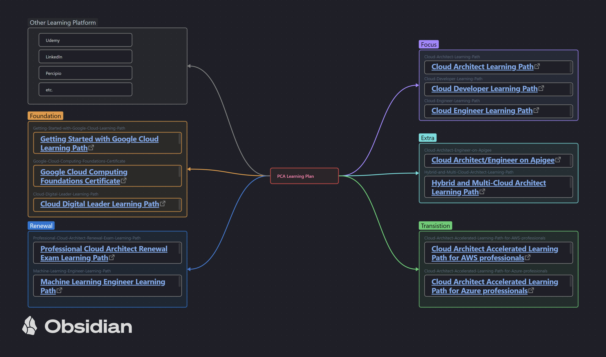
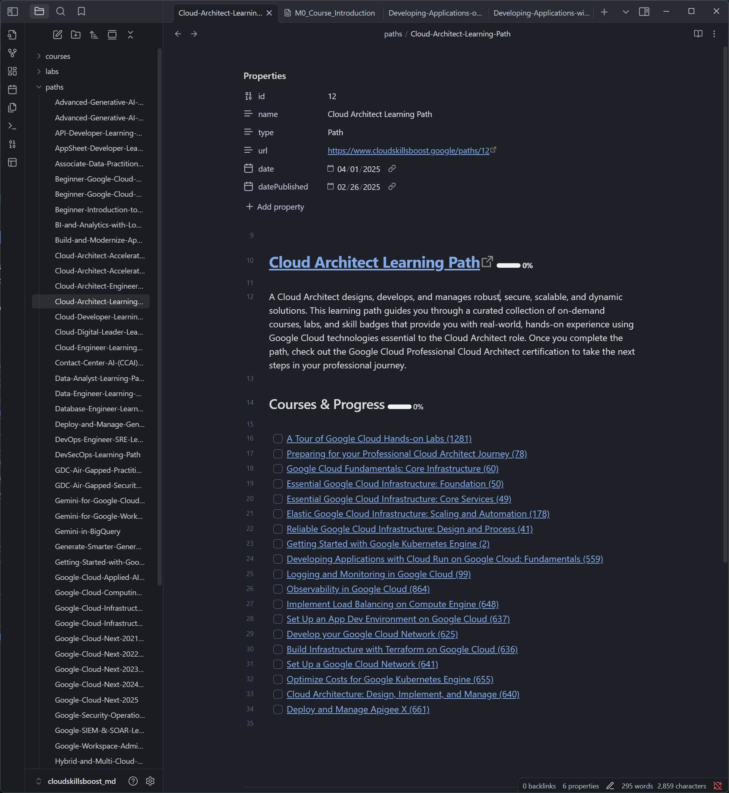
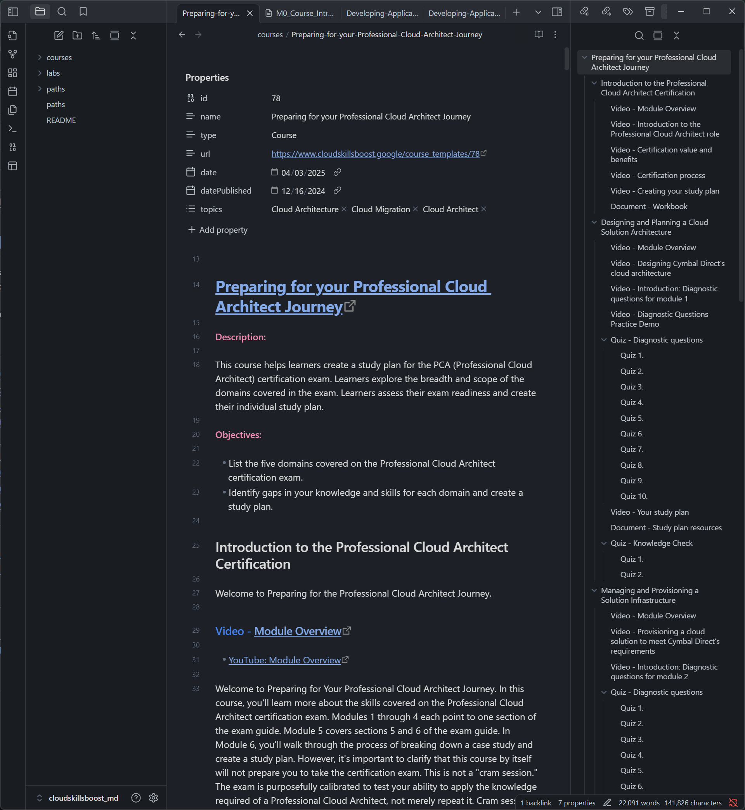
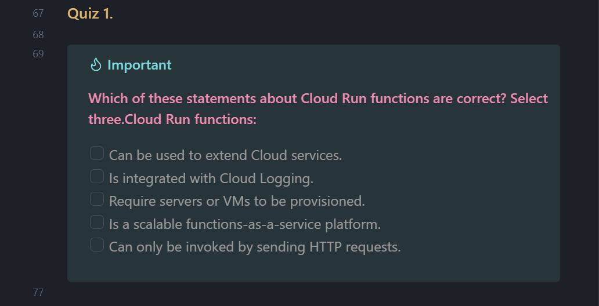
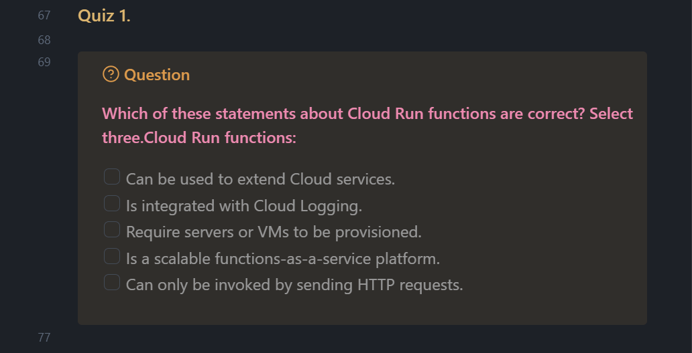
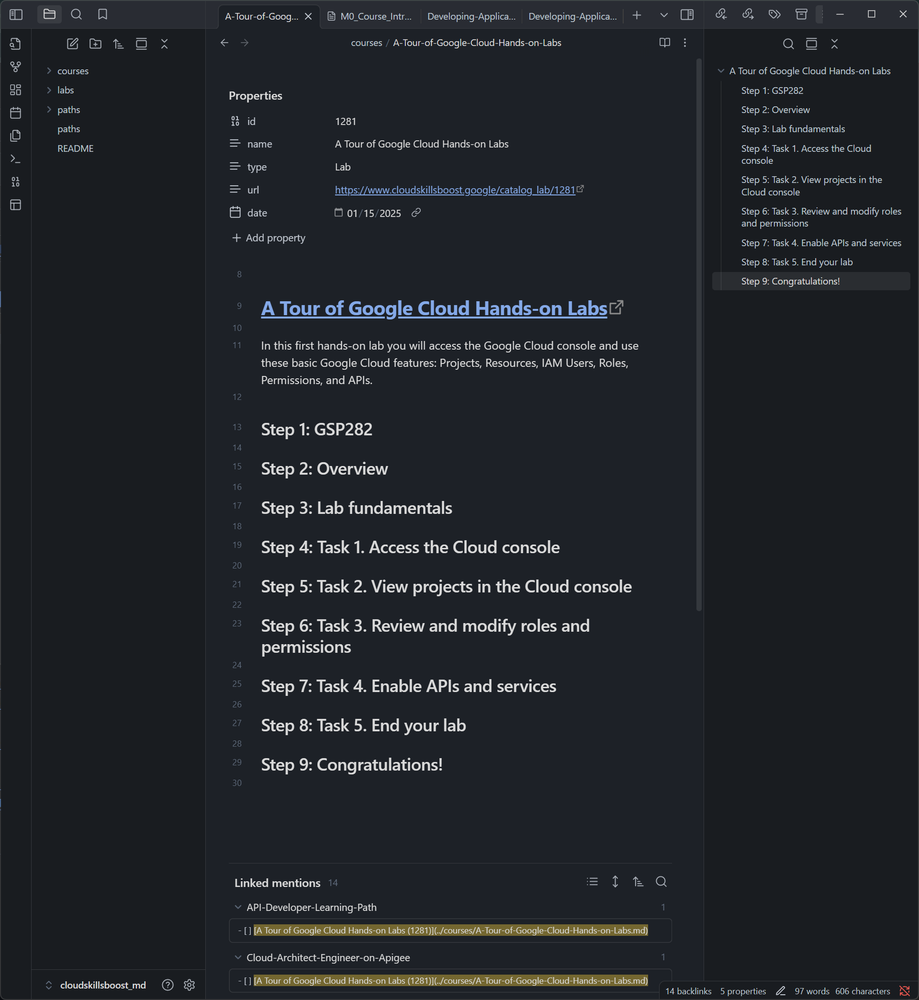
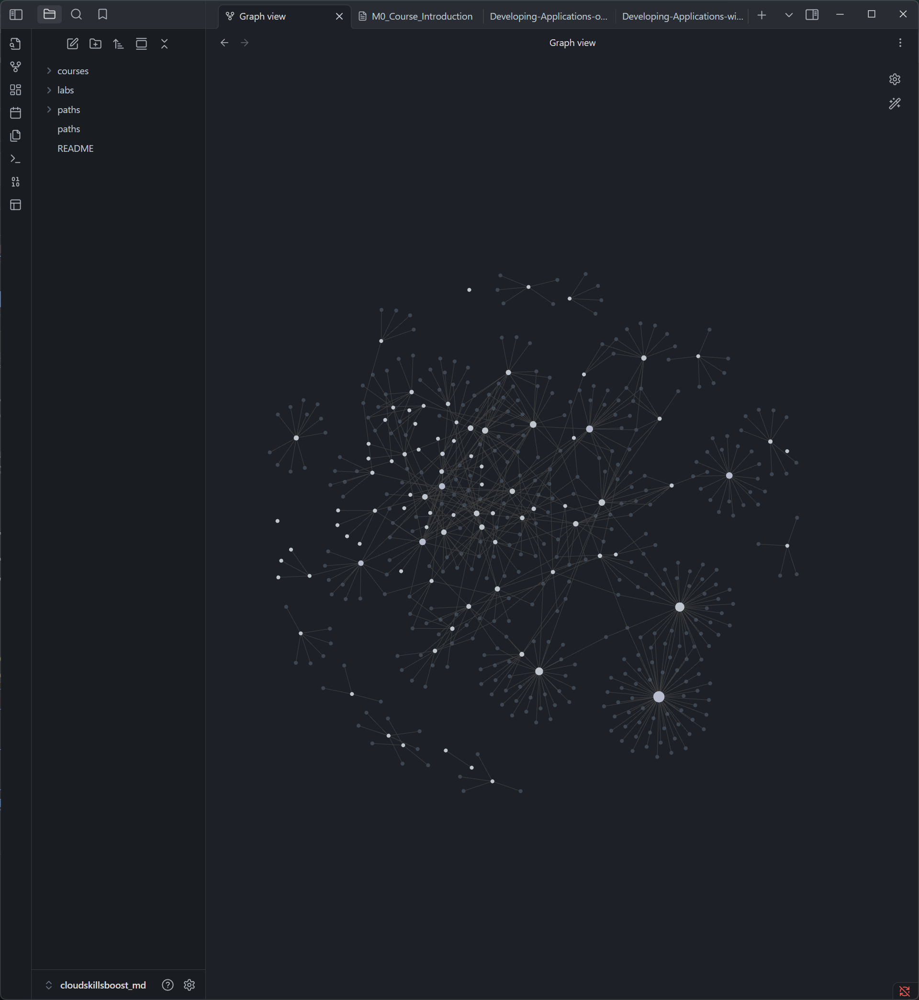
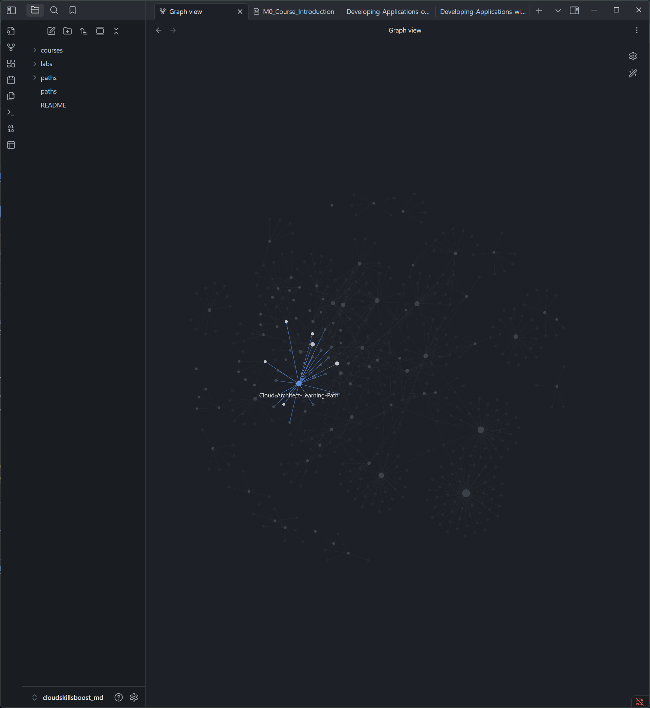
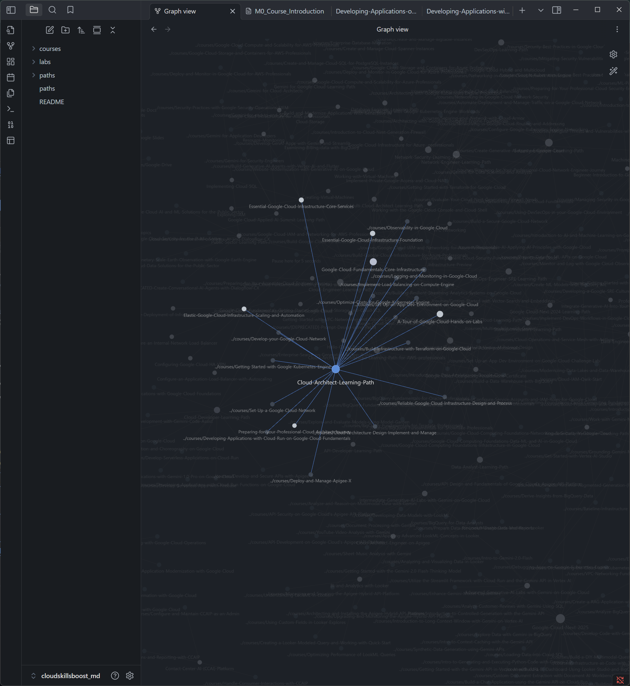

# A Cloud Skills Boost MD Vault

## What is this?

- To take your personal notes on courses/paths/labs.
- A source vault for your NotebookLM or similar tools.
- Created by: [Google Cloud Skills Boost Helper & Scraping](https://github.com/samdx/cloudskillsboost-helper)

How to start:

- Click into a Path under the `paths` folder, example: `Cloud-Architect-Learning-Path`.
- Open each course from the path, complete all the modules/labs/quiz, and tick check-box for them if any.
- Complete the course by ticking the check-box on the path.
- Continue.

The idea:

- A Path contains courses.
- A Course contains modules.
    - A Module contains lessons (videos/documents) and Lab(s).
    - A Course may belong to one or many Paths.
    - A Lab may belong to one or many Courses.
- This builds a structured folder tree.

Refer to:

- [paths](paths.md) for all the available paths.

Note:

- The [paths](paths.md) or [README](README.md) will not link to any course or lab or path files, to avoid a mess in Obsidian graph.
- If a course comes with PDF documents/resources, you may not need to utilize videos' transcript. Instead use the course markdown file as a personal note.

### How to contribute

- Generate a new file if it's MISSING, and commit/PR here.
    - Do not commit an edited file, keep the file as it is newly generated.
- Contribute to the tool instead: [Google Cloud Skills Boost Helper & Scraping](https://github.com/samdx/cloudskillsboost-helper)

## An example mind map

- Refer to 

## The Vault In Action

### A Path

### A Course

#### A Quiz

#### A Quiz with a different look

### A Lab

### Graph

### Graph (Hovered)

### Graph (Hovered, Cont)

